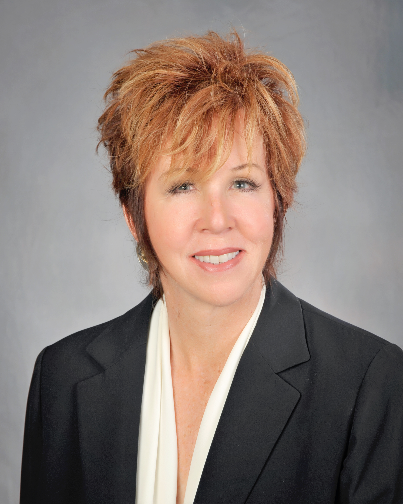
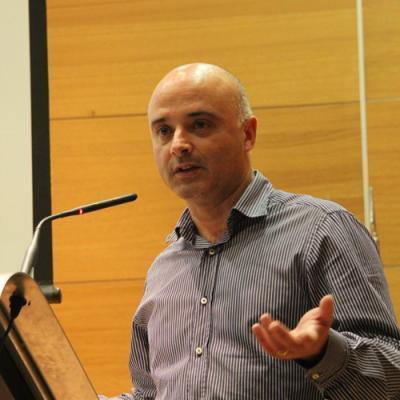
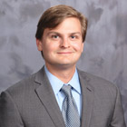

# **Robots in the Wild: Challenges in Deploying Robust Autonomy for Robotic Exploration**

## **Invited Speakers**

1. [**Robin Murphy**](http://faculty.cse.tamu.edu/murphy/), Texas A&M University, USA.
2. [**Jo&atilde;o Sousa**](https://whale.fe.up.pt/member/jo%C3%A3o-sousa), University of Porto, Portugal.
3. [**Stefan B. Williams**](https://sydney.edu.au/engineering/people/stefan.williams.php), University of Sydney, Australia.
4. [**Geoff Hollinger**](http://research.engr.oregonstate.edu/rdml/), Oregon State University, USA.

Details of talks are as follows.

* [**Robin Murphy**](http://faculty.cse.tamu.edu/murphy/), Texas A&M University, USA.

**A User-Centric Perspective on Robust Autonomy in Unstructured Environments**  
Ground, aerial, and marine vehicles are becoming increasingly common for disasters and emergency management. These platforms have typically been teleoperated rather than tasked with full autonomy. While it might be assumed that this is because autonomous capabilities are not available, the data shows that even when autonomy is available, operators have turned it off or did not need the autonomous features. This talk will discuss case studies from Fukushima Daiichi, Hurricane Harvey and other recent disasters illustrating the causes for the lack of trust in autonomy. The case studies will illustrate the ways in which off-normal events increase the demands on robots and operators, and by extension, on autonomous capabilities. 
They will also highlight the challenges in designing systems for formative domains where work is conducted in unstructured environments. The talk will conclude with recommendations for taking a user-centric systems design approach to creating high capable and truly useful robots for unstructured environments. 

**Bio**:
Dr. Robin R. Murphy is the Raytheon Professor of Computer Science and Engineering at Texas A&M University, a founding director of the Center for Robot-Assisted Search and Rescue, and an IEEE fellow. She helped found the fields of disaster robotics and human-robot interaction, concentrating on developing human-centered AI for ground, air, and marine robots. Her work is captured in over 150 scientific publications including the award-winning book Disaster Robotics and a TED talk as well as a textbook Introduction to AI Robotics (second edition 2019). Murphy has deployed robots to over 28 disasters in five countries including the 9/11 World Trade Center, Hurricane Katrina, 2 mine disasters, Fukushima, the Syrian boat refugee crisis, Hurricane Harvey, and the Kilauea volcanic eruption. Murphy’s contributions to disaster robotics have been recognized with the ACM Eugene L. Lawler Award for Humanitarian Contributions, the AUVSI Foundation’s Al Aube Award, and the Motohiro Kisoi Award for Rescue Engineering Education. She is also the editor for the science fiction/science fact focus series for the journal Science Robotics and author of Robotics Through Science Fiction: Artificial Intelligence Explained Through Six Classic Robot Stories.

* [**Jo&atilde;o Sousa**](https://whale.fe.up.pt/member/jo%C3%A3o-sousa), University of Porto, Portugal.

**Exploring the Pacific Subtropical Front: adventures in coordinated ship-robotic surveys**  
One of the next logical steps in oceanographic field studies concerns open-ocean coordinated ship-robotic operations. But this requires new developments, as well as new concepts of operation and experimentation at sea. This is exactly what the “Exploring the Subtropical front with multiple robots cruise” funded by the Schmidt Ocean Institute was about.  
In this talk I discuss the lessons learned during this cruise and outline future challenges in coordinated ship-robotic surveys. First, the scientific and technological goals are briefly presented as a background for the discussion on coordinated ship-robotic surveys. Second, the tools and technologies used to enable coordinated surveys are discussed with special emphasis on the LSTS software tool chain. Third, key aspects of the 3-week operational deployment are described with focus on the 24/7 operations and on the spatial and temporal footprint of the coordinated operations. Finally, short term developments and future challenges are discussed in the framework of a systems breakdown structure, which is a way of structuring systems.

**Bio**:
Jo&atilde;o Tasso de Figueiredo Borges de Sousa is with the Electrical and Computer Engineering Department from Porto University in Portugal. He holds a PhD and an MSc in Electrical Engineering, both awarded by Porto University. His research interests include autonomous underwater, surface and air vehicles, planning and execution control for networked vehicle systems, optimization and control, cyber-physical systems, and applications of networked vehicle systems to the ocean sciences, security and defense.  
He is the head of the Laboratório de Sistemas e Tecnologias Subaquáticas – LSTS (Underwater Systems and Technologies Laboratory). The LSTS developed the award-winning Light Autonomous Underwater Vehicle (LAUV) and the LSTS open source software tool chain for networked vehicle systems [(https://www.lsts.pt/toolchain)](https://www.lsts.pt/toolchain).  
He has been organizing the annual Rapid Environmental Picture MUS exercise in cooperation with the Portuguese Navy since 2010, and with the Centre for Maritime Research and Experimentation since 2014. He was the chair of the 2013 edition of the IFAC Navigation, Guidance and Control Workshop and of the 2018 IEEE AUV Symposium. He is a member of the Advisory Board of the Swedish Marine Robotics Center. He is in the editorial board of several scientific journals. He is a member of several NATO committees. He has authored over 400 publications, including 40 journal papers.

* [**Stefan B. Williams**](https://sydney.edu.au/engineering/people/stefan.williams.php), University of Sydney, Australia.

Under construction

* [**Geoff Hollinger**](http://research.engr.oregonstate.edu/rdml/), Oregon State University, USA.

**Marine Robotics: Planning, Decision Making, and Human-Robot Learning**  
Underwater gliders, propeller-driven submersibles, and other marine robots are increasingly being tasked with gathering information (e.g., in environmental monitoring, offshore inspection, and coastal surveillance scenarios). However, in most of these scenarios, human operators must carefully plan the mission to ensure completion of the task. Strict human oversight not only makes such deployments expensive and time consuming but also makes some tasks impossible due to the requirement for heavy cognitive loads or reliable communication between the operator and the vehicle. We can mitigate these limitations by making the robotic information gatherers semi-autonomous, where the human provides high-level input to the system and the vehicle fills in the details on how to execute the plan. In this talk, I will show how a general framework that unifies information theoretic optimization and physical motion planning makes semi-autonomous information gathering feasible in marine environments. In particular, I will discuss results from a recent deployment in the Gulf of Mexico where four underwater gliders and two surface vehicles autonomously mapped an upwelling front using our framework.
 
**Bio**:
Geoff Hollinger is an Assistant Professor in the Collaborative Robotics and Intelligent Systems (CoRIS) Institute at Oregon State University. His current research interests are in adaptive information gathering, distributed coordination, and learning for autonomous robotic systems. He has previously held research positions at the University of Southern California, Intel Research Pittsburgh, University of Pennsylvania’s GRASP Laboratory, and NASA's Marshall Space Flight Center. He received his Ph.D. (2010) and M.S. (2007) in Robotics from Carnegie Mellon University and his B.S. in General Engineering along with his B.A. in Philosophy from Swarthmore College (2005). He is a recipient of the ONR YIP award (2017) and the NSF CAREER award (2019).